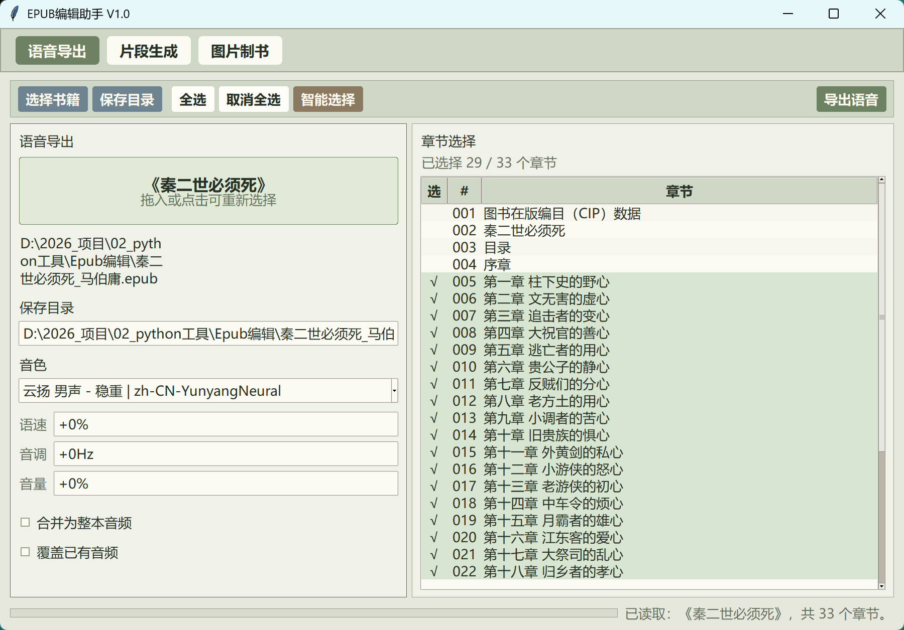
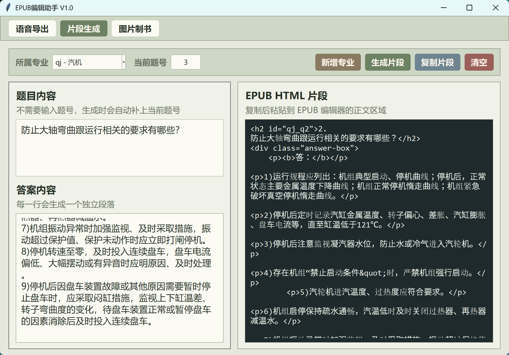
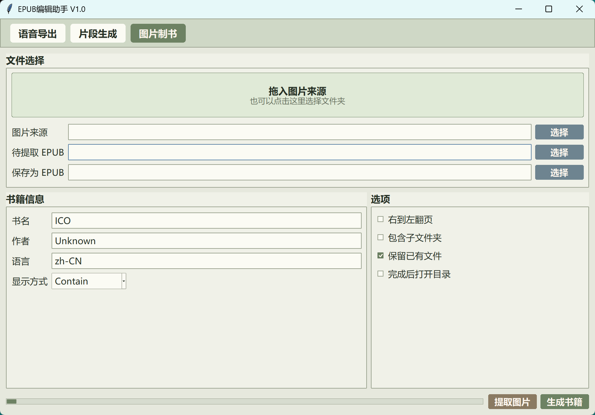

# Epub工具箱

`Epub工具箱` 是一个面向 EPUB 日常整理的 Windows 桌面工具，当前版本为 `V1.0`。它把语音导出、片段生成、图片制书三个常用流程放在同一个窗口里，通过顶部菜单栏切换界面。

这个项目适合用来处理个人 EPUB 资料、制作图片型电子书、从 EPUB 中提取图片，以及把章节内容批量导出为语音文件。

## 功能概览

- 语音导出：拖入或选择 EPUB，读取章节目录，勾选章节后导出 MP3 音频。
- 片段生成：维护分类和题号，生成可粘贴到 EPUB 编辑器正文区域的 HTML 片段。
- 图片制书：拖入或选择图片来源文件夹，将图片打包为 EPUB。
- 图片提取：从已有 EPUB 中提取图片资源。
- 拖放操作：语音导出和图片制书界面均支持拖入文件或文件夹，也保留点击选择。
- 本地打包：内置 PyInstaller 打包脚本，可生成单文件 exe。

## 界面预览

### 语音导出

<p align="center">
  
</p>

### 片段生成

<p align="center">
  
</p>

### 图片制书

<p align="center">
  
</p>

## 使用场景

- 想把 EPUB 章节转为音频，方便听书或校对文本。
- 想把一组漫画、扫描图、插画或长图整理为 EPUB。
- 想从图片型 EPUB 中批量提取原图。
- 想在编辑 EPUB 时快速生成带编号的 HTML 内容片段。

## 环境要求

- Windows 10 或 Windows 11
- Python `>=3.10,<3.14`
- uv
- 可选：ffmpeg，用于语音导出时合并整本音频

主要依赖：

- `edge-tts`：语音合成
- `tkinterdnd2`：窗口拖放支持
- `pyinstaller`：打包 exe，仅构建时需要

## 快速开始

同步依赖：

```bat
uv sync --extra build
```

运行程序：

```bat
uv run main.py
```

也可以直接双击或执行：

```bat
运行.bat
```

## 打包

执行：

```bat
打包.bat
```

打包完成后会生成：

```text
dist\Epub工具箱.exe
dist\tiku_config.json
```

打包脚本已包含 `tkinterdnd2` 的数据文件收集参数，避免打包后拖入功能失效。

## 项目结构

```text
.
├─ main.py             主程序与菜单栏界面
├─ epub_tts.py         EPUB 文本解析与 TTS 转换核心
├─ epub_tts_tool.py    语音导出界面
├─ image_epub_tool.py  图片制书与图片提取界面
├─ tiku_config.json    片段生成分类与题号配置
├─ pyproject.toml      uv 项目配置
├─ uv.lock             uv 锁定文件
├─ 运行.bat            本地运行脚本
├─ 打包.bat            Windows 打包脚本
├─ logo/               应用图标
└─ docs/screenshots/   README 截图目录
```

## 功能说明

### 语音导出

1. 拖入 EPUB，或点击拖入框选择书籍。
2. 程序读取章节目录并自动勾选正文章节。
3. 选择音色、语速、音调、音量。
4. 可选择合并为整本音频，或按章节分别导出。
5. 点击导出，生成 MP3 文件。

说明：合并整本音频需要本机可调用 `ffmpeg`。

### 片段生成

1. 选择专业或分类。
2. 输入题目和答案。
3. 生成 HTML 片段。
4. 复制后粘贴到 EPUB 编辑器正文区域。

题号进度保存在 `tiku_config.json` 中，便于连续编辑。

### 图片制书

1. 拖入图片文件夹，或点击选择图片来源。
2. 填写书名、作者、语言和显示方式。
3. 选择 EPUB 保存位置。
4. 生成图片型 EPUB。

支持的图片格式包括 `jpg`、`jpeg`、`png`、`gif`、`webp`。

### 图片提取

1. 选择待提取的 EPUB。
2. 选择图片保存目录。
3. 执行提取，程序会将 EPUB 内的图片资源导出到目标文件夹。

## 上传 GitHub 前建议

- 不要提交 `.venv/`、`dist/`、`build/`、`__pycache__/`。
- 不要提交测试 EPUB、生成的音频、生成的图片目录。
- 如果截图较多，建议压缩到合适大小后放入 `docs/screenshots/`。
- 如果计划公开分发 exe，可以在 Release 页面上传构建产物，而不是提交到仓库。

## 常见问题

### 拖入框不能拖入

确认已经同步依赖：

```bat
uv sync
```

如果是打包后的 exe 不能拖入，请确认使用的是本项目提供的 `打包.bat`，其中包含 `tkinterdnd2` 的数据文件收集参数。

### 语音导出失败

先确认网络可访问 Edge TTS 服务。如果选择了合并整本音频，还需要确认本机已经安装并配置好 `ffmpeg`。

### 中文显示乱码

脚本已切换到 UTF-8 代码页。如果仍然乱码，建议使用 Windows Terminal 或 PowerShell 运行。

## 版本

当前版本：`V1.0`

## 许可

如果需要开源发布，建议在仓库中补充 `LICENSE` 文件。
